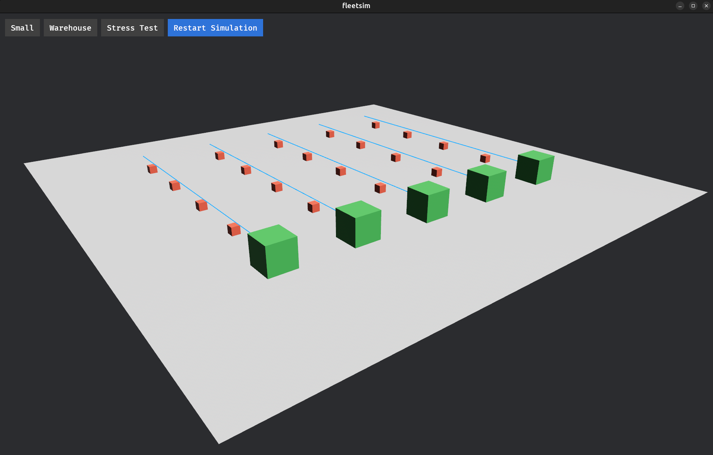

# FleetSim: A Rust + Bevy Multi-Robot Warehouse Simulation
A 3D multi-robot warehouse simulation platform built in Rust + Bevy, focused on:
- discrete-event simulation
- fleet task allocation
- traffic conflict detection
- interactive tooling/UI for rapid iteration

Designed as a portfolio piece aligned with robotics software, simulation, and game/graphics engineering roles.



## Run
```bash
cargo run
```

## Controls
- `W/A/S/D`: move camera
- `Space` / `Left Shift`: move camera up / down
- Hold `Right Mouse Button` + move mouse: look around
- Click `Small`, `Warehouse`, or `Stress Test`: switch scenario
- Click `Restart Simulation`: reset the current scenario

## Scenarios
| Preset | Robots | Tasks | Layout |
|---|---|---|---|
| Small | 3 | 8 | Pseudo-random placement |
| Warehouse | 5 | 25 | Robots in a row, tasks in a 5×5 grid |
| Stress Test | 10 | 30 | Robots in a 5×2 grid, tasks pseudo-random |

## What It Does
- Spawns a ground plane, robots, and task markers
- Allocates the nearest unassigned task to each idle robot (fleet coordination)
- Moves robots through scheduled discrete events (time-ordered event queue)
- Draws robot paths with gizmo lines
- Detects traffic conflicts using robot-robot distance checks
- Highlights collisions by switching robot materials in real time
- Supports multiple scenario presets and full simulation reset via UI buttons

## Project Structure
- `src/main.rs`: app wiring and system registration
- `src/model.rs`: shared components, resources, types, and scenario definitions
- `src/camera.rs`: camera setup and controls
- `src/simulation.rs`: world setup and simulation systems
- `src/ui.rs`: UI setup, scenario switching, and restart behaviour

## To do:
- Add simulation controls: pause, step, speed multiplier, seed control.
- Visual polish: labels for robot/task IDs, task state colors, and collision heatmap/trails.
